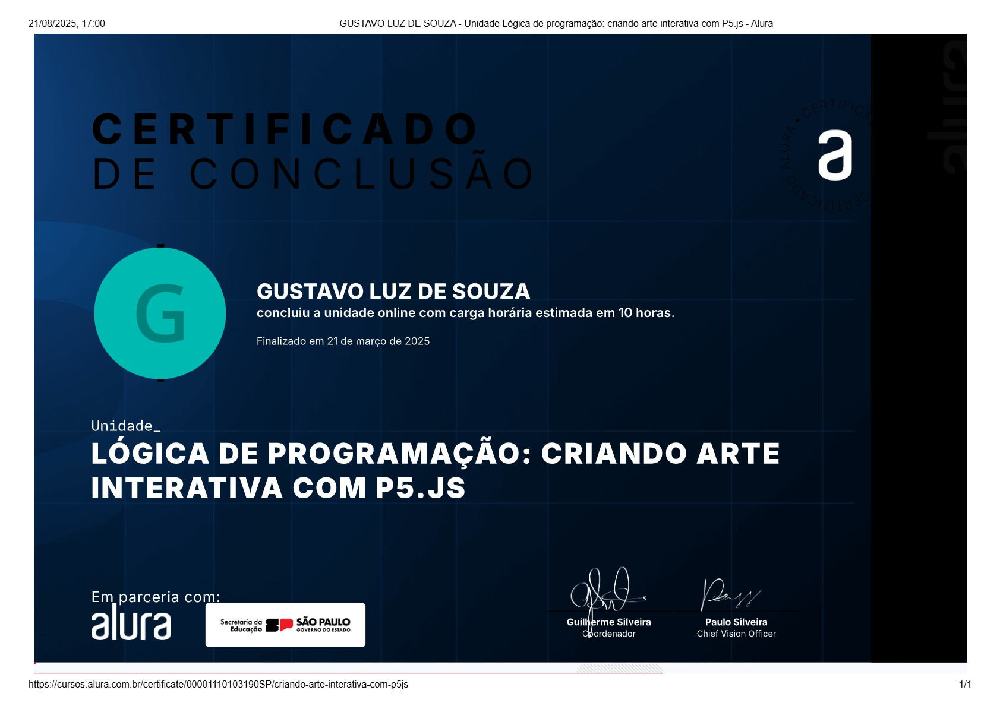

<!DOCTYPE html>
<html lang="pt-br">
<head>
  <meta charset="UTF-8" />
  <meta name="viewport" content="width=device-width, initial-scale=1.0" />
  <link href="https://cdn.jsdelivr.net/npm/bootstrap@5.3.7/dist/css/bootstrap.min.css" rel="stylesheet">
  <link rel="stylesheet" href="style.css">
  <title>Meu portfólio</title>
</head>

<body>
  <header class="container text-center py-5"> 
    
    
Eu sou Gustavo

    <h1>Quero entrar no rumo de programação</h1>
    
Sou Gustavo Luz de Souza, atualmente tenho 16 anos, gosto de programação. Meu desejo é um dia programar um jogo de sucesso, sou bom com números e gosto de escrever. Tenho alguns certificados que ganhei fazendo cursos na Alura.

    
Minhas habilidades:

    

      Lógica de programação
      Prestativo
      Bom com contas
      Trabalho em equipe
    

  </header>

  <main class="container mt-3">
    <h2 class="mb-4">Meus projetos</h2>
    

      <!-- PROJETO 1 -->
      

        

          
          

            <h5 class="card-title">Projeto corrida parte 1</h5>
            
Esse foi um projeto em Java sobre corrida. Um projeto simples, porém com cuidado e empenho no desenvolvimento.

            <button type="button" data-bs-toggle="modal" data-bs-target="#modal1" class="btn btn-info">Olhar projeto</button>
          

        

      

      <!-- PROJETO 2 -->
      

        

          
          

            <h5 class="card-title">Projeto corrida parte 2</h5>
            
Segunda parte do projeto de corrida, aprimorando o conhecimento e simplificando o código para melhor desempenho e resultado visual.

            <button type="button" data-bs-toggle="modal" data-bs-target="#modal2" class="btn btn-info">Olhar projeto</button>
          

        

      

      <!-- PROJETO 3 -->
      

        

          
          

            <h5 class="card-title">Projeto Rosto</h5>
            
Primeiro projeto do ano, simples mas com resultado interessante. Observando os projetos percebo melhora no desempenho.

            <button type="button" data-bs-toggle="modal" data-bs-target="#modal3" class="btn btn-info">Olhar projeto</button>
          

        

      

    

  </main>

  <!-- MODAIS -->
  <!-- Modal 1 -->
  

    

      

        

          <h5 class="modal-title">Projeto Corrida Parte 1</h5>
          <button type="button" class="btn-close" data-bs-dismiss="modal" aria-label="Fechar"></button>
        

        

          
Projeto de programação Java. Primeira vez lidando com Java, desafiador, mas com aprendizado progressivo e resultado satisfatório.

          
        

        

          <a href="mailto:gusluz2931@gmail.com" class="btn btn-primary">Entrar em contato</a>
        

      

    

  

  <!-- Modal 2 -->
  

    

      

        

          <h5 class="modal-title">Projeto Corrida Parte 2</h5>
          <button type="button" class="btn-close" data-bs-dismiss="modal" aria-label="Fechar"></button>
        

        

          
Projeto parte 2, aprimorando o código e tornando-o mais eficiente e compreensível.

          
        

        

          <a href="mailto:gusluz2931@gmail.com" class="btn btn-primary">Entrar em contato</a>
        

      

    

  

  <!-- Modal 3 -->
  

    

      

        

          <h5 class="modal-title">Projeto Rosto</h5>
          <button type="button" class="btn-close" data-bs-dismiss="modal" aria-label="Fechar"></button>
        

        

          
Projeto sobre rostos, melhorando técnica e desempenho.

          
        

        

          <a href="mailto:gusluz2931@gmail.com" class="btn btn-primary">Entrar em contato</a>
        

      

    

  

  <!-- Footer -->
  <footer class="container py-5 text-center">
    <h2>Entre em contato</h2>
    

      <a href="mailto:gusluz2931@gmail.com" class="me-3">EMAIL</a>
      <a href="tel:+5511941159018">TELEFONE</a>
    

    
&copy; 2025. Produzido por Gustavo Luz

  </footer>

  
</body>
</html>
w
